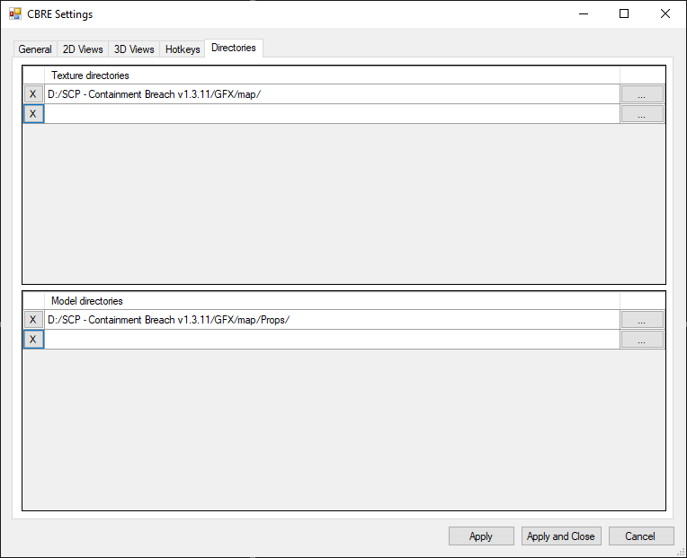
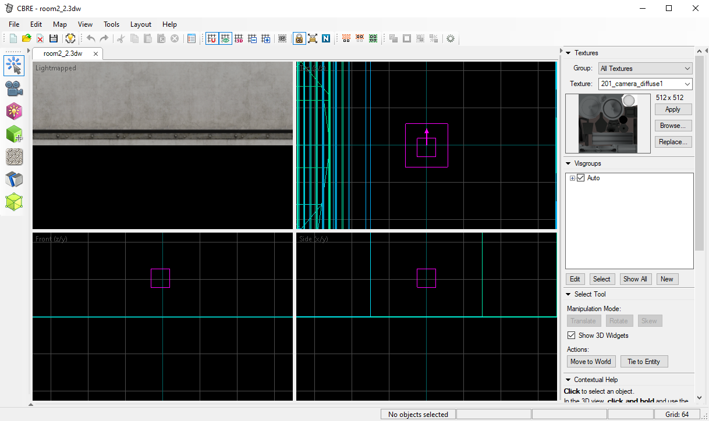
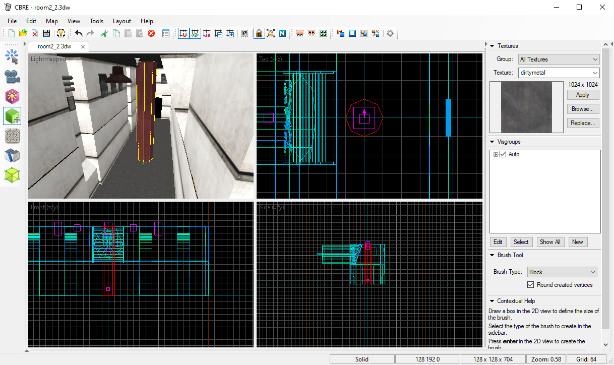
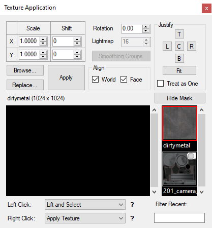
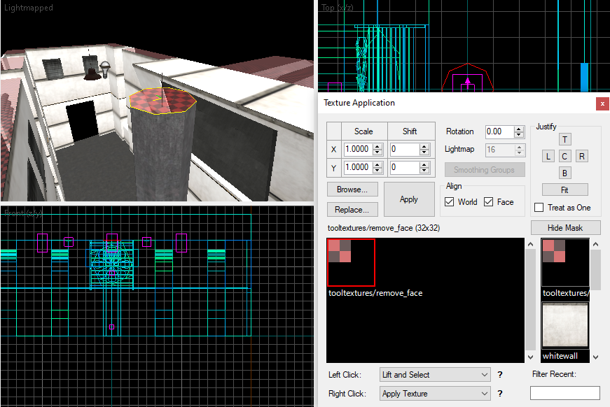
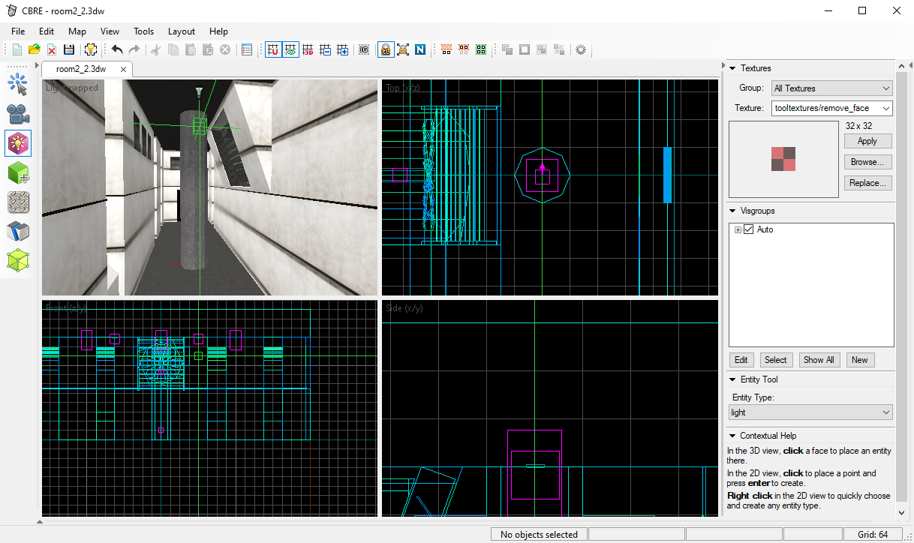
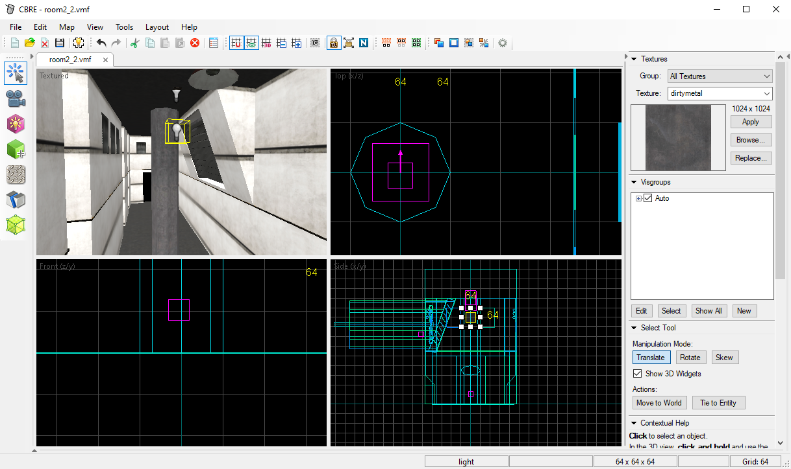
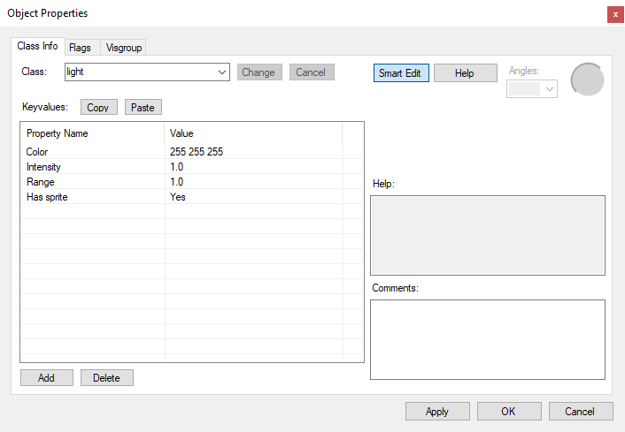
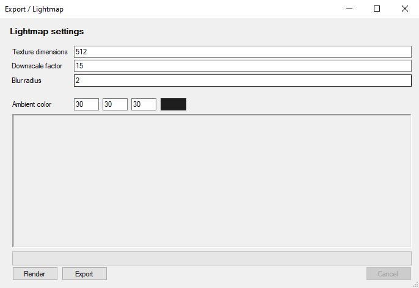
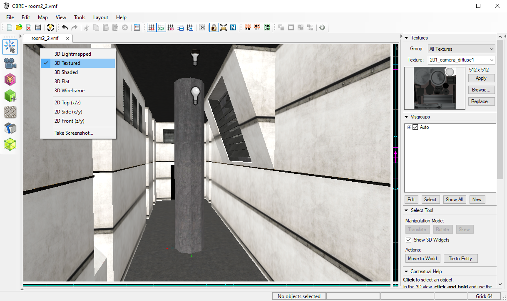

# Basic guide

## Getting started

Get the latest CBRE release from here: https://github.com/juanjp600/cbre/releases

Get a collection of editable room files from here: http://scpcbgame.com/rooms.rar

Extract the contents of the zip file you got into a folder, then launch `CBRE.Editor.exe`.

If you haven't configured CBRE before, you should be greeted with a window that looks like this:

You'll have to provide the paths to the textures and props that you will be using in your mod, as seen in the following screenshot:

Once you're done configuring everything to your liking, hit `Apply and Close`.

It's entirely possible to create a room from scratch if you know the dimensions that you need to be working with, but in general I'd recommend loading up one of the existing rooms that were linked at the start of this guide and build upon it.

For this guide, I've loaded up `room2_2.3dw`:

## Tool overview

### Select Tool - positioning, scaling and rotation

This tool is pretty straightforward. In any of the views, just click on the entity you want to interact with. You can also change the size of brushes by dragging the squares that appear along the edges. By clicking several times within one of the 2D views, you can switch between resizing, rotation and shearing.

### Camera - self-explanatory

The controls for the `Camera Tool` are fairly straightforward. Just select it from the toolbar on the left, and then hold left click in the 3D view. You should now be able to move the camera around using WASD. You can adjust the movement speed in the settings.

You can also reposition the camera by dragging the orange circle in the 2D views.

### Brush Tool - adding geometry

Before you add in new geometry, I recommend browsing for the texture you want to use by browsing for it with the button in the right panel.

To add in new geometry, you will need to create a brush using the `Brush Tool`. You can find it on the toolbar on the left.

Once you've selected it, you can select a shape in the bottom right corner. Typically, the block is suitable for most cases, but in this example I've selected the cylinder.

Click and hold the Left Mouse Button in one of the 2D views. As you drag it, you should see that a translucent preview of the brush should show up.

You can let go of the Left Mouse Button and adjust the size and position of it by dragging the edges and corners.

Once you're happy with your the size and position of your brush, hit the Enter key to create it.

### Texture Application Tool - assigning textures to specific faces

Sometimes, you'll find that you don't want all faces of your brush to have the same texture. It's also inevitable that there will be certain faces that you want to remove, to improve in-game performance and lightmap rendering times.

To apply textures to specific faces, you'll need to use the `Texture Application Tool`, which can be found on the toolbar on the left.

As soon as you click on it, the following window will pop up:

With this tool selected, left click on a face that needs its texture changed. To select several faces, hold Ctrl and then click on all of the faces you want to retexture.

Once you've selected all the required faces, browse for the texture you want to use and hit `Apply`.

Additionally, you can change the scale and alignment of the textures on the selected faces by using the Scale, Shift and Rotation fields shown above. As a shortcut, hitting the Fit button with scale and align the texture in such a way that the whole texture will be visible.

In the following example, I've used `tooltextures/remove_face`. All faces with this texture will be ignored by the lightmapper and removed from the final room:

### Entity Tool - adding lights and other point entities

To add a point entity, select the `Entity Tool`, found on the toolbar on the left. Select the desired entity type using the dropdown on the bottom right.

Left click on one of the 2D views, and you'll see a preview of the position of the entity, plus some lines for the sake of alignment:

You can drag this preview around. Once the positioning is just right, hit Enter to spawn the entity:

While the entity is selected, press Alt+Enter to access its properties:

In _SCP - Containment Breach_, lights typically have a range of 800 to 1200 units. You should also adjust the intensity and color to match the color scheme of the room you're working with.

Once you've adjusted the properties, hit OK.

### Clip Tool - splitting brushes

First, select a brush using the `Select Tool`. Then, select the `Clip Tool` from the toolbar on the left and click and hold the Left Mouse Button on one of the 2D views. You'll see a white line that goes through the brush, and a plane on the 3D view:

By clicking on the `Clip Tool` several times, you can choose which of the brushes (either one, or both) to retain once you perform the clip operation. The geometry that will be retained is indicated by having white edges.

When you have set up the correct clipping plane, hit Enter. If you've preserved both brushes, you can interact with them separately:

## Rendering lightmaps & exporting to RMesh

Once you're done messing about with the geometry and entities, you can preview the lighting that will be seen in-game, and export the final RMesh file. To do this, click on the `Export / Lightmap` button on the top toolbar, or hit F9.

You'll be greeted by the following window:

`Texture dimensions` indicates the resolution of the resulting lightmap files that are exported. Lightmap resolutions higher than 512x512 don't work very nicely with the bump mapping in _SCP - Containment Breach v1.3.11_ unless you adjust the game's source code and recompile it (this issue will be eliminated entirely for _v1.4_, as it uses a better bumpmap technique)

`Downscale factor` roughly determines how many units are represented in a single luxel. The lower the number, the higher the lightmap quality will be. Too low of a number might not fit in four lightmaps, so make sure to adjust it if your room has a lot of geometry.

`Blur radius` determines the radius of a simple blur pass to hide any imperfections caused by the lightmaps' limited resolution.

As there usually isn't much reason to adjust these settings, you can go ahead and hit `Render`. If you have a very complex room and/or many lights, this may take upwards of five minutes (Gate B and the intro room can take this long)

Once the lightmaps are rendered, you will be able to see the result in the 3D view:

If you intend to continue adjusting the geometry or lighting, you'll find that the lightmaps don't update automatically and you should change the rendering mode to `3D Textured` to hide them until you re-render them:

Once your room is finalized, hit `Export` instead of `Render` in order to get an RMesh file that can be loaded and explored in-game.
